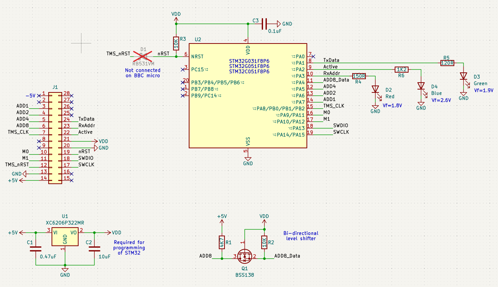

# PCB

This PCB was designed using Kicad v9.06.

The STM32G051F8P6 MCU is well suited to this project, having 5V tolerant IO, 64K of flash storage and capable of running at 64MHz. STM32G031F8P6 and STM32C051F8P6 should work also.

The PCB has a placeholder for JLCPCB order number, select the correct options when ordering.

Folder AD2_Tests contains Digilent Waveforms workspace configurations for Analog Discovery 2 that were used to test basic read functionality before putting it into the micro.

