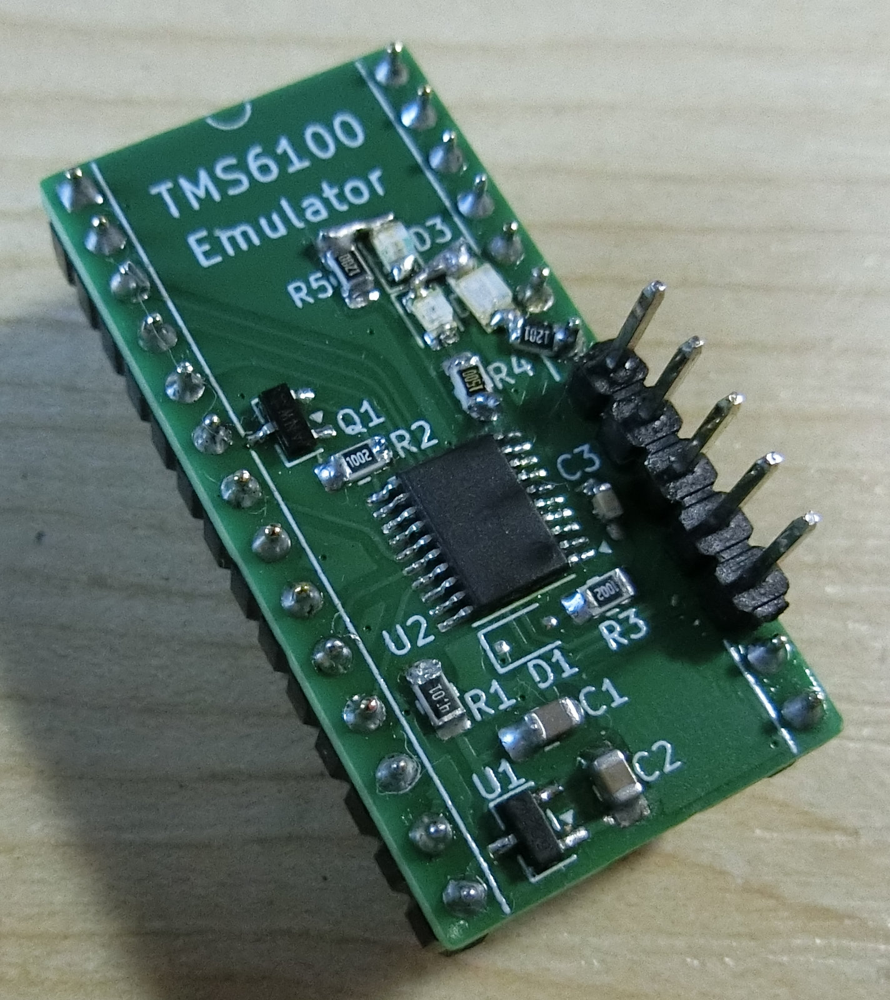
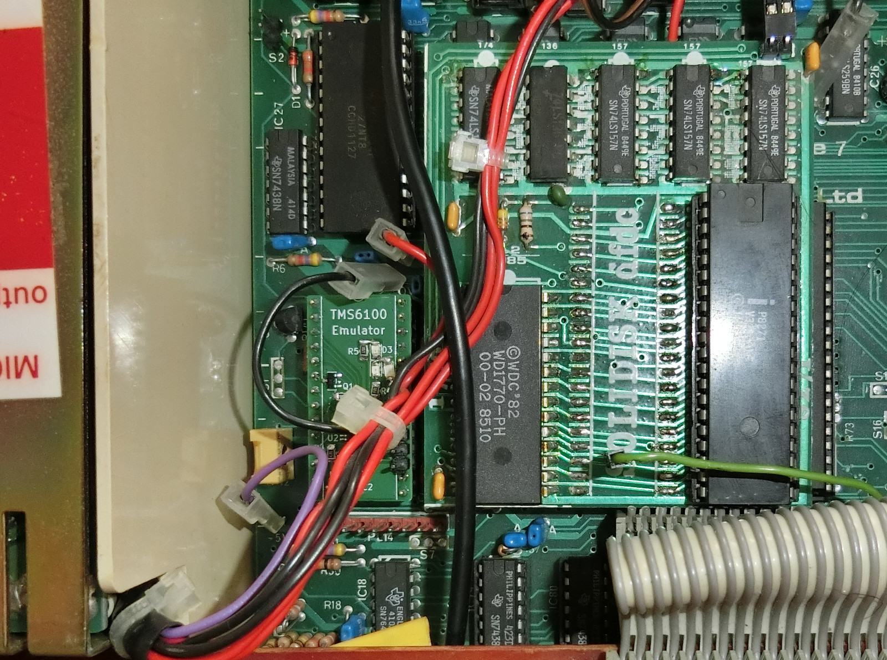

# TMS6100 milti-PHROM

This project contains the PCB design and firmware for a TMS6100 emulator, accommodating the following PHROM images:

* Acorn PHROMA (News presenter Kenneth Kendall's voice, Acorn specific format), bank 15
* VM61002 - the PHROM fitted to Acorn computer speech kits sold in the USA (American male voice, indexed phrases), bank 0
* VM10004 - military radio phrases (American male voice, non-indexed phrases), bank 2
* VM71003 - talking clock (American female voice, indexed phrases), bank 4

There is also the option in Firmware/Common/Inc/ROMdata.h to make the following selection:

* Acorn PHROMA (News presenter Kenneth Kendall's voice, Acorn specific format), bank 15
* CD2325a - TI-99/4A PHROM part 1, bank 0
* CD2326a - TI-99/4A PHROM part 2, bank 1
* VM71003 - talking clock (American female voice, indexed phrases), bank 4

Uncomment `#define PHROMS_TI99` and re-build the project. It is provided for experimentation, but the TI-99 phrases were intended for the TMS5200 and don't sound quite right on the TMS5220. To use this emulator in an actual TI-99 speech synthesizer module, pin 13 (CS) must be connected to ground (0V). Schematics for the module show this pin as being connected to +5V.

Content of the PHROMs are documented in the source files located in Firmware/Common/Src/ROMdata_*

The PCB has the footprint of a DIP-28 and is intended to be plugged into the IC98 socket on the BBC Micro model A/B motherboard.

It is a fully-featured implementation, providing indirect addressing and compatibility with other PHROMs connected to the same bus, provided they don't operate in the same address space (check the PHROM bank numbers).

The project is subdivided into multiple sections, stored in the following folders:

* PCB - The Kicad project for the PCB
* Firmware - The STM32CubeIDE project providing the firmware
* Scripts - Utilities for converting data
* BASIC2 - BBC BASIC programs for testing the multi-PHROM
* Images - Photos of the constructed PCB and installation

Each of these sections has their own README, providing more information.
